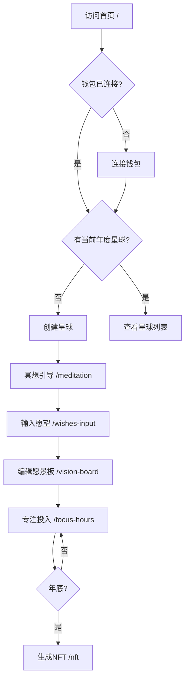

# VisionFocus Hours - 前端路由设计文档

## 📋 目录
- [路由概述](#路由概述)
- [路由架构](#路由架构)
- [页面路由详情](#页面路由详情)
- [路由守卫](#路由守卫)
- [路由配置](#路由配置)
- [导航流程](#导航流程)
- [实现示例](#实现示例)

---

## 路由概述

### 技术选型
- **框架**: React Router v6 / Vue Router v4
- **模式**: History Mode (HTML5 History API)
- **懒加载**: 支持代码分割
- **过渡动画**: 页面切换动画

### 路由策略
- 单页应用(SPA)架构
- 基于用户状态的访问控制
- 支持浏览器前进/后退
- 记录用户访问路径

---

## 路由架构

### 整体流程图

```
┌─────────────────────────────────────────────────────────────┐
│                        首页入口                              │
│                    / (HomePage)                             │
│                    1starthome.html                          │
│                                                             │
│  功能:                                                       │
│  - 钱包连接                                                  │
│  - 星球宇宙展示                                              │
│  - 创建/选择年度星球                                         │
└─────────────────────────────────────────────────────────────┘
                            │
                ┌───────────┴───────────┐
                │                       │
            新用户                   老用户
                │                       │
                ▼                       ▼
┌──────────────────────────┐  ┌──────────────────────────┐
│     冥想引导页            │  │    直接进入星球           │
│  /meditation             │  │  /planet/:year           │
│  2deepthink.html         │  │                          │
│                          │  └──────────────────────────┘
│  功能:                    │
│  - 5阶段冥想引导          │
│  - 背景音乐播放           │
│  - 呼吸动画              │
│  - 完成标记              │
└──────────────────────────┘
                │
                ▼
┌──────────────────────────┐
│    愿望碎片输入页         │
│  /wishes-input           │
│  3dreamfragment.html     │
│                          │
│  功能:                    │
│  - 输入1-12个愿望碎片    │
│  - 自动识别图标          │
│  - 保存到本地            │
└──────────────────────────┘
                │
                ▼
┌──────────────────────────┐
│    愿景板编辑页           │
│  /vision-board           │
│  4visionboard.html       │
│                          │
│  功能:                    │
│  - 愿景板设计            │
│  - 上传图片              │
│  - 添加贴纸/文字         │
│  - 保存配置              │
└──────────────────────────┘
                │
                ▼
┌──────────────────────────┐
│    专注时光投入页         │
│  /focus-hours            │
│  5hoursputin.html        │
│                          │
│  功能: (核心!)           │
│  - 存入专注时光          │
│  - 投币动画              │
│  - 显化效果展示          │
│  - 里程碑通知            │
└──────────────────────────┘
                │
                ▼
┌──────────────────────────┐
│    年度NFT生成页          │
│  /nft                    │
│  6NFT.html               │
│                          │
│  功能:                    │
│  - 生成NFT元数据         │
│  - 铸造NFT               │
│  - 查看NFT               │
└──────────────────────────┘
```

---

## 页面路由详情

### 1. 首页 - 星球宇宙
**路由**: `/`  
**文件**: `1starthome.html`  
**标题**: `VisionFocus Hours · 星球宇宙`

#### 功能特性
- 展示用户的个人宇宙
- 显示所有年度星球
- 钱包连接入口
- 创建新星球按钮

#### 访问控制
- ✅ 无需登录即可访问
- ✅ 未连接钱包显示连接提示
- ✅ 已连接钱包显示星球列表

#### URL参数
无

#### 跳转路径
```
/ → /meditation (创建新星球)
/ → /planet/:year (进入已有星球)
```

---

### 2. 冥想引导页
**路由**: `/meditation`  
**文件**: `2deepthink.html`  
**标题**: `VisionFocus Hours · 星球冥想引导`

#### 功能特性
- 5个阶段的冥想引导
- 打字机效果文字显示
- 背景音乐播放
- 呼吸动画圆圈
- 进度指示器

#### 访问控制
- ⚠️ 需要已连接钱包
- ⚠️ 需要已创建当前年度星球
- ⚠️ 如果已完成冥想,自动跳转到下一步

#### URL参数
- `?year=2026` (可选): 指定年份

#### 跳转路径
```
/meditation → /wishes-input (完成冥想)
/meditation → / (返回首页)
```

---

### 3. 愿望碎片输入页
**路由**: `/wishes-input`  
**文件**: `3dreamfragment.html`  
**标题**: `VisionFocus Hours · 输入愿望碎片`

#### 功能特性
- 动态添加愿望碎片卡片
- 支持1-12个愿望
- 自动识别愿望类型和图标
- 示例关键词快速填充
- 保存到LocalStorage

#### 访问控制
- ⚠️ 需要已连接钱包
- ⚠️ 需要已完成冥想
- ✅ 可以返回修改

#### URL参数
- `?year=2026` (可选): 指定年份

#### 跳转路径
```
/wishes-input → /vision-board (至少1个愿望)
/wishes-input → /meditation (返回冥想)
```

---

### 4. 愿景板编辑页
**路由**: `/vision-board`  
**文件**: `4visionboard.html`  
**标题**: `VisionFocus Hours · 沉浸式愿景板编辑`

#### 功能特性
- 愿景板画布编辑
- 上传愿望关联图片
- 添加贴纸和装饰
- 添加文字元素
- 布局和样式调整
- 实时预览
- 保存配置

#### 访问控制
- ⚠️ 需要已连接钱包
- ⚠️ 需要至少有1个愿望碎片
- ✅ 可以随时返回编辑

#### URL参数
- `?year=2026` (可选): 指定年份
- `?mode=edit` (可选): 编辑模式

#### 跳转路径
```
/vision-board → /focus-hours (保存并继续)
/vision-board → /fullscreen (全屏预览)
/vision-board → /wishes-input (返回修改愿望)
```

---

### 5. 专注时光投入页 (核心页面!)
**路由**: `/focus-hours`  
**文件**: `5hoursputin.html`  
**标题**: `VisionFocus Hours · 专注时光投资`

#### 功能特性
- 显示所有愿望碎片
- "存入专注时光"按钮
- 投币动画效果
- 显化效果动画(4个等级)
- 里程碑通知
- 实时更新专注时间
- 愿景板背景展示

#### 访问控制
- ⚠️ 需要已连接钱包
- ⚠️ 需要已有愿景板
- ✅ 可以随时访问

#### URL参数
- `?year=2026` (可选): 指定年份
- `?wish=:wishId` (可选): 高亮特定愿望

#### 跳转路径
```
/focus-hours → /fullscreen (全屏查看)
/focus-hours → /nft (年底生成NFT)
/focus-hours → /vision-board (编辑愿景板)
/focus-hours → /statistics (查看统计)
```

#### 显化效果等级
- **Level 0**: 初始状态 (0-9小时)
- **Level 1**: 星星点点 (10-29小时) - `--milestone-10: #87CEEB`
- **Level 2**: 微光荧光 (30-59小时) - `--milestone-30: #98FB98`
- **Level 3**: 金色流光 (60-99小时) - `--milestone-60: #FFD700`
- **Level 4**: 钻石七彩 (100+小时) - `--milestone-100: #9370DB`

---

### 6. 年度NFT生成页
**路由**: `/nft`  
**文件**: `6NFT.html`  
**标题**: `VisionFocus Hours · 年度NFT纪念`

#### 功能特性
- 展示年度总结数据
- 生成NFT预览
- 上传到IPFS
- 铸造NFT到链上
- 查看铸造状态
- 展示已铸造的NFT

#### 访问控制
- ⚠️ 需要已连接钱包
- ⚠️ 需要至少有专注记录
- ⚠️ 建议年底或达到一定时长后访问

#### URL参数
- `?year=2026` (必需): 指定年份
- `?preview=true` (可选): 预览模式

#### 跳转路径
```
/nft → /focus-hours (返回投入页)
/nft → / (返回首页)
```

---

### 7. 全屏查看模式
**路由**: `/fullscreen`  
**文件**: 复用 `5hoursputin.html` (隐藏控制栏)

#### 功能特性
- 全屏显示愿景板
- 展示显化效果
- 隐藏所有控制按钮
- 按ESC退出

#### 访问控制
- ⚠️ 需要已有愿景板

#### URL参数
- `?year=2026` (可选): 指定年份

#### 跳转路径
```
/fullscreen → /focus-hours (按ESC退出)
```

---

### 8. 用户个人中心 (未来扩展)
**路由**: `/profile`  
**标题**: `VisionFocus Hours · 个人中心`

#### 功能特性
- 查看用户信息
- 修改昵称/头像
- 查看所有星球
- 查看所有NFT
- 数据导出/导入
- 设置偏好

#### 访问控制
- ⚠️ 需要已连接钱包

---

### 9. 统计分析页 (未来扩展)
**路由**: `/statistics`  
**标题**: `VisionFocus Hours · 数据统计`

#### 功能特性
- 专注时间趋势图
- 愿望完成度分析
- 时段分布热力图
- 年度对比
- 连续专注天数

#### 访问控制
- ⚠️ 需要已连接钱包
- ⚠️ 需要有专注记录

---

## 路由守卫

### 全局前置守卫

```javascript
// router/guards.js
export function globalBeforeEach(to, from, next) {
  // 1. 检查钱包连接状态
  const isWalletConnected = checkWalletConnection();
  
  // 2. 需要认证的路由
  const requiresAuth = [
    '/meditation',
    '/wishes-input',
    '/vision-board',
    '/focus-hours',
    '/nft',
    '/profile',
    '/statistics'
  ];
  
  if (requiresAuth.includes(to.path) && !isWalletConnected) {
    // 未连接钱包,跳转到首页
    showNotification('请先连接钱包');
    return next('/');
  }
  
  // 3. 检查星球是否存在
  if (to.path !== '/' && to.path !== '/profile') {
    const year = to.query.year || new Date().getFullYear();
    const planet = getPlanetByYear(year);
    
    if (!planet) {
      showNotification('请先创建年度星球');
      return next('/');
    }
  }
  
  // 4. 检查流程顺序
  const flowCheck = checkFlowOrder(to.path);
  if (!flowCheck.valid) {
    showNotification(flowCheck.message);
    return next(flowCheck.redirect);
  }
  
  // 5. 页面埋点
  trackPageView(to.path);
  
  next();
}

// 检查流程顺序
function checkFlowOrder(path) {
  const planet = getCurrentPlanet();
  
  // 检查是否完成冥想
  if (path === '/wishes-input' && !planet.meditationCompleted) {
    return {
      valid: false,
      message: '请先完成冥想引导',
      redirect: '/meditation'
    };
  }
  
  // 检查是否有愿望碎片
  if ((path === '/vision-board' || path === '/focus-hours') && 
      planet.wishes.length === 0) {
    return {
      valid: false,
      message: '请先添加愿望碎片',
      redirect: '/wishes-input'
    };
  }
  
  return { valid: true };
}
```

### 路由元信息

```javascript
const routes = [
  {
    path: '/',
    name: 'Home',
    component: HomePage,
    meta: {
      title: 'VisionFocus Hours · 星球宇宙',
      requiresAuth: false,
      keepAlive: true
    }
  },
  {
    path: '/meditation',
    name: 'Meditation',
    component: MeditationPage,
    meta: {
      title: '冥想引导',
      requiresAuth: true,
      requiresPlanet: true,
      step: 1
    }
  },
  {
    path: '/wishes-input',
    name: 'WishesInput',
    component: WishesInputPage,
    meta: {
      title: '愿望碎片输入',
      requiresAuth: true,
      requiresPlanet: true,
      requiresMeditation: true,
      step: 2
    }
  },
  {
    path: '/vision-board',
    name: 'VisionBoard',
    component: VisionBoardPage,
    meta: {
      title: '愿景板编辑',
      requiresAuth: true,
      requiresPlanet: true,
      requiresWishes: true,
      step: 3
    }
  },
  {
    path: '/focus-hours',
    name: 'FocusHours',
    component: FocusHoursPage,
    meta: {
      title: '专注时光投资',
      requiresAuth: true,
      requiresPlanet: true,
      requiresVisionBoard: true,
      step: 4
    }
  },
  {
    path: '/nft',
    name: 'NFT',
    component: NFTPage,
    meta: {
      title: '年度NFT纪念',
      requiresAuth: true,
      requiresPlanet: true,
      step: 5
    }
  }
];
```

---

## 路由配置

### React Router 完整配置

```javascript
// router/index.jsx
import { createBrowserRouter, RouterProvider } from 'react-router-dom';
import { lazy, Suspense } from 'react';

// 懒加载页面组件
const HomePage = lazy(() => import('@/pages/HomePage'));
const MeditationPage = lazy(() => import('@/pages/MeditationPage'));
const WishesInputPage = lazy(() => import('@/pages/WishesInputPage'));
const VisionBoardPage = lazy(() => import('@/pages/VisionBoardPage'));
const FocusHoursPage = lazy(() => import('@/pages/FocusHoursPage'));
const NFTPage = lazy(() => import('@/pages/NFTPage'));
const FullscreenPage = lazy(() => import('@/pages/FullscreenPage'));
const ProfilePage = lazy(() => import('@/pages/ProfilePage'));
const StatisticsPage = lazy(() => import('@/pages/StatisticsPage'));

// 加载中组件
const LoadingFallback = () => (
  <div className="loading-container">
    <div className="loading-spinner"></div>
    <p>加载中...</p>
  </div>
);

// 路由配置
const router = createBrowserRouter([
  {
    path: '/',
    element: (
      <Suspense fallback={<LoadingFallback />}>
        <HomePage />
      </Suspense>
    )
  },
  {
    path: '/meditation',
    element: (
      <Suspense fallback={<LoadingFallback />}>
        <MeditationPage />
      </Suspense>
    )
  },
  {
    path: '/wishes-input',
    element: (
      <Suspense fallback={<LoadingFallback />}>
        <WishesInputPage />
      </Suspense>
    )
  },
  {
    path: '/vision-board',
    element: (
      <Suspense fallback={<LoadingFallback />}>
        <VisionBoardPage />
      </Suspense>
    )
  },
  {
    path: '/focus-hours',
    element: (
      <Suspense fallback={<LoadingFallback />}>
        <FocusHoursPage />
      </Suspense>
    )
  },
  {
    path: '/nft',
    element: (
      <Suspense fallback={<LoadingFallback />}>
        <NFTPage />
      </Suspense>
    )
  },
  {
    path: '/fullscreen',
    element: (
      <Suspense fallback={<LoadingFallback />}>
        <FullscreenPage />
      </Suspense>
    )
  },
  {
    path: '/profile',
    element: (
      <Suspense fallback={<LoadingFallback />}>
        <ProfilePage />
      </Suspense>
    )
  },
  {
    path: '/statistics',
    element: (
      <Suspense fallback={<LoadingFallback />}>
        <StatisticsPage />
      </Suspense>
    )
  },
  {
    path: '*',
    element: <NotFoundPage />
  }
]);

export default function AppRouter() {
  return <RouterProvider router={router} />;
}
```

### Vue Router 配置

```javascript
// router/index.js
import { createRouter, createWebHistory } from 'vue-router';

const routes = [
  {
    path: '/',
    name: 'Home',
    component: () => import('@/views/HomePage.vue'),
    meta: { title: '星球宇宙' }
  },
  {
    path: '/meditation',
    name: 'Meditation',
    component: () => import('@/views/MeditationPage.vue'),
    meta: { title: '冥想引导', requiresAuth: true }
  },
  {
    path: '/wishes-input',
    name: 'WishesInput',
    component: () => import('@/views/WishesInputPage.vue'),
    meta: { title: '愿望碎片', requiresAuth: true }
  },
  {
    path: '/vision-board',
    name: 'VisionBoard',
    component: () => import('@/views/VisionBoardPage.vue'),
    meta: { title: '愿景板', requiresAuth: true }
  },
  {
    path: '/focus-hours',
    name: 'FocusHours',
    component: () => import('@/views/FocusHoursPage.vue'),
    meta: { title: '专注时光', requiresAuth: true }
  },
  {
    path: '/nft',
    name: 'NFT',
    component: () => import('@/views/NFTPage.vue'),
    meta: { title: 'NFT生成', requiresAuth: true }
  },
  {
    path: '/fullscreen',
    name: 'Fullscreen',
    component: () => import('@/views/FullscreenPage.vue'),
    meta: { title: '全屏查看' }
  },
  {
    path: '/:pathMatch(.*)*',
    name: 'NotFound',
    component: () => import('@/views/NotFoundPage.vue')
  }
];

const router = createRouter({
  history: createWebHistory(),
  routes,
  scrollBehavior(to, from, savedPosition) {
    if (savedPosition) {
      return savedPosition;
    } else {
      return { top: 0 };
    }
  }
});

// 全局前置守卫
router.beforeEach((to, from, next) => {
  // 设置页面标题
  document.title = to.meta.title 
    ? `${to.meta.title} - VisionFocus Hours` 
    : 'VisionFocus Hours';
  
  // 认证检查
  if (to.meta.requiresAuth) {
    const isConnected = checkWalletConnection();
    if (!isConnected) {
      return next('/');
    }
  }
  
  next();
});

export default router;
```

---

## 导航流程

### 新用户首次访问流程



### 老用户回访流程

```mermaid
graph TD
    A[访问首页 /] --> B[自动连接钱包]
    B --> C[显示星球列表]
    C --> D{选择操作}
    D -->|查看当前星球| E[/focus-hours]
    D -->|创建新年度星球| F[/meditation]
    D -->|查看历史星球| G[/planet/:year]
    D -->|查看NFT集合| H[/nft]
    D -->|个人中心| I[/profile]
```

---

## 导航组件

### 返回导航

```javascript
// components/BackButton.jsx
import { useNavigate } from 'react-router-dom';

export function BackButton({ to, label = '返回' }) {
  const navigate = useNavigate();
  
  const handleBack = () => {
    if (to) {
      navigate(to);
    } else {
      navigate(-1); // 返回上一页
    }
  };
  
  return (
    <button className="back-button" onClick={handleBack}>
      <i className="fas fa-arrow-left"></i>
      {label}
    </button>
  );
}
```

### 步骤导航

```javascript
// components/StepNavigation.jsx
export function StepNavigation({ currentStep }) {
  const steps = [
    { step: 1, name: '冥想引导', path: '/meditation' },
    { step: 2, name: '愿望碎片', path: '/wishes-input' },
    { step: 3, name: '愿景板', path: '/vision-board' },
    { step: 4, name: '专注投入', path: '/focus-hours' },
    { step: 5, name: 'NFT纪念', path: '/nft' }
  ];
  
  return (
    <div className="step-navigation">
      {steps.map((step) => (
        <div 
          key={step.step}
          className={`step ${currentStep === step.step ? 'active' : ''} ${currentStep > step.step ? 'completed' : ''}`}
        >
          <div className="step-number">{step.step}</div>
          <div className="step-name">{step.name}</div>
        </div>
      ))}
    </div>
  );
}
```

---

## 页面过渡动画

### CSS过渡动画

```css
/* styles/transitions.css */

/* 页面淡入淡出 */
.page-fade-enter {
  opacity: 0;
}

.page-fade-enter-active {
  opacity: 1;
  transition: opacity 0.5s ease;
}

.page-fade-exit {
  opacity: 1;
}

.page-fade-exit-active {
  opacity: 0;
  transition: opacity 0.5s ease;
}

/* 页面滑动 */
.page-slide-enter {
  transform: translateX(100%);
}

.page-slide-enter-active {
  transform: translateX(0);
  transition: transform 0.5s ease;
}

.page-slide-exit {
  transform: translateX(0);
}

.page-slide-exit-active {
  transform: translateX(-100%);
  transition: transform 0.5s ease;
}

/* 页面缩放 */
.page-zoom-enter {
  transform: scale(0.9);
  opacity: 0;
}

.page-zoom-enter-active {
  transform: scale(1);
  opacity: 1;
  transition: all 0.5s ease;
}
```

### React过渡组件

```javascript
// App.jsx
import { CSSTransition, TransitionGroup } from 'react-transition-group';
import { useLocation } from 'react-router-dom';

function App() {
  const location = useLocation();
  
  return (
    <TransitionGroup>
      <CSSTransition
        key={location.pathname}
        classNames="page-fade"
        timeout={500}
      >
        <AppRouter />
      </CSSTransition>
    </TransitionGroup>
  );
}
```

---

## URL查询参数

### 通用参数

| 参数 | 说明 | 示例 | 必需 |
|-----|------|------|------|
| `year` | 指定年份 | `?year=2026` | 否 |
| `preview` | 预览模式 | `?preview=true` | 否 |
| `debug` | 调试模式 | `?debug=true` | 否 |

### 页面特定参数

#### /focus-hours
- `wish=:wishId` - 高亮特定愿望
- `animation=false` - 禁用动画(演示模式)

#### /vision-board
- `mode=edit` - 编辑模式
- `mode=view` - 查看模式

#### /nft
- `step=preview` - 预览步骤
- `step=mint` - 铸造步骤

---

## 面包屑导航

```javascript
// components/Breadcrumb.jsx
export function Breadcrumb() {
  const location = useLocation();
  
  const breadcrumbMap = {
    '/': '首页',
    '/meditation': '冥想引导',
    '/wishes-input': '愿望碎片',
    '/vision-board': '愿景板',
    '/focus-hours': '专注时光',
    '/nft': 'NFT纪念'
  };
  
  return (
    <div className="breadcrumb">
      <Link to="/">首页</Link>
      {location.pathname !== '/' && (
        <>
          <span className="separator">/</span>
          <span className="current">{breadcrumbMap[location.pathname]}</span>
        </>
      )}
    </div>
  );
}
```

---

## 路由工具函数

### 导航辅助函数

```javascript
// utils/navigation.js

/**
 * 导航到下一步
 */
export function goToNextStep(currentPath, navigate) {
  const flowMap = {
    '/meditation': '/wishes-input',
    '/wishes-input': '/vision-board',
    '/vision-board': '/focus-hours',
    '/focus-hours': '/nft'
  };
  
  const nextPath = flowMap[currentPath];
  if (nextPath) {
    navigate(nextPath);
  }
}

/**
 * 导航到上一步
 */
export function goToPrevStep(currentPath, navigate) {
  const flowMap = {
    '/wishes-input': '/meditation',
    '/vision-board': '/wishes-input',
    '/focus-hours': '/vision-board',
    '/nft': '/focus-hours'
  };
  
  const prevPath = flowMap[currentPath];
  if (prevPath) {
    navigate(prevPath);
  } else {
    navigate('/');
  }
}

/**
 * 检查是否可以访问某个路由
 */
export function canAccessRoute(path) {
  const planet = getCurrentPlanet();
  if (!planet) return false;
  
  const requirements = {
    '/wishes-input': () => planet.meditationCompleted,
    '/vision-board': () => planet.wishes.length > 0,
    '/focus-hours': () => planet.visionBoard !== null,
    '/nft': () => planet.totalFocusHours > 0
  };
  
  const check = requirements[path];
  return check ? check() : true;
}
```

---

## 404页面

```javascript
// pages/NotFoundPage.jsx
import { useNavigate } from 'react-router-dom';

export default function NotFoundPage() {
  const navigate = useNavigate();
  
  return (
    <div className="not-found-page">
      <div className="not-found-content">
        <h1>404</h1>
        <p>页面不存在</p>
        <button onClick={() => navigate('/')}>
          返回首页
        </button>
      </div>
    </div>
  );
}
```

---

## 路由埋点

```javascript
// utils/analytics.js
import { useEffect } from 'react';
import { useLocation } from 'react-router-dom';

export function usePageTracking() {
  const location = useLocation();
  
  useEffect(() => {
    // Google Analytics
    if (window.gtag) {
      gtag('config', 'GA_MEASUREMENT_ID', {
        page_path: location.pathname
      });
    }
    
    // 自定义埋点
    trackPageView({
      path: location.pathname,
      title: document.title,
      timestamp: new Date().toISOString()
    });
  }, [location]);
}
```

---

## 总结

### 核心路由(6个)
1. ✅ `/` - 首页(星球宇宙)
2. ✅ `/meditation` - 冥想引导
3. ✅ `/wishes-input` - 愿望碎片输入
4. ✅ `/vision-board` - 愿景板编辑
5. ✅ `/focus-hours` - 专注时光投入 ⭐核心
6. ✅ `/nft` - NFT生成

### 辅助路由
7. ✅ `/fullscreen` - 全屏查看
8. 🔄 `/profile` - 个人中心(未来)
9. 🔄 `/statistics` - 数据统计(未来)

### 路由特性
- ✅ 基于流程的访问控制
- ✅ 钱包连接状态检查
- ✅ 星球存在性验证
- ✅ 页面过渡动画
- ✅ 懒加载优化
- ✅ 埋点追踪

这套路由设计完全覆盖了你的6个HTML页面,并为未来扩展预留了空间! 🚀

